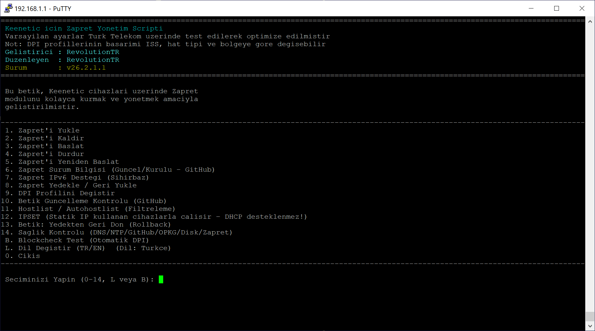
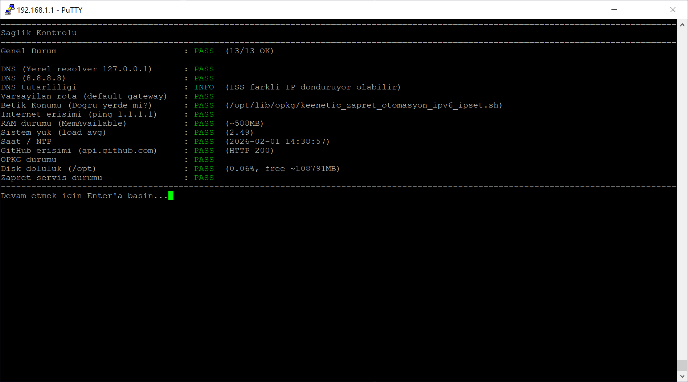
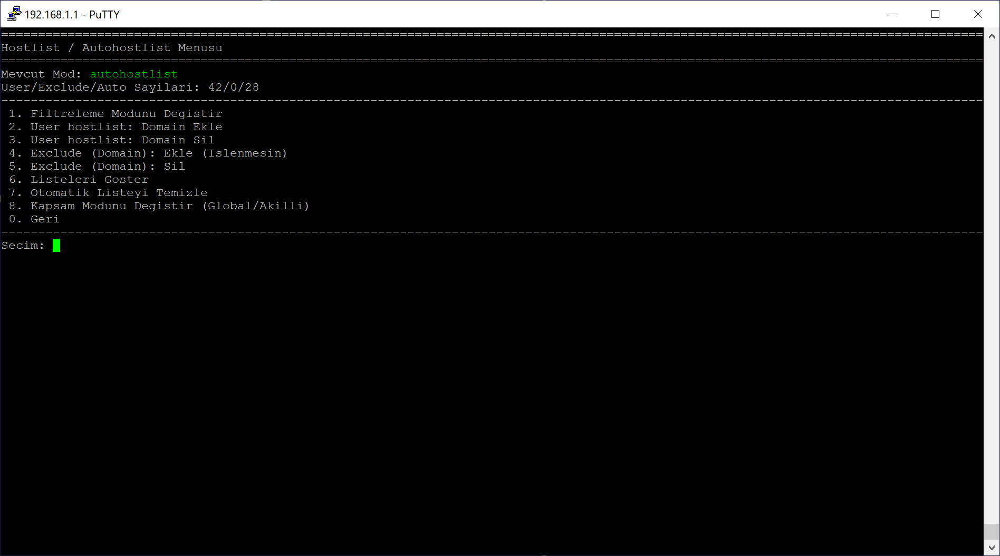
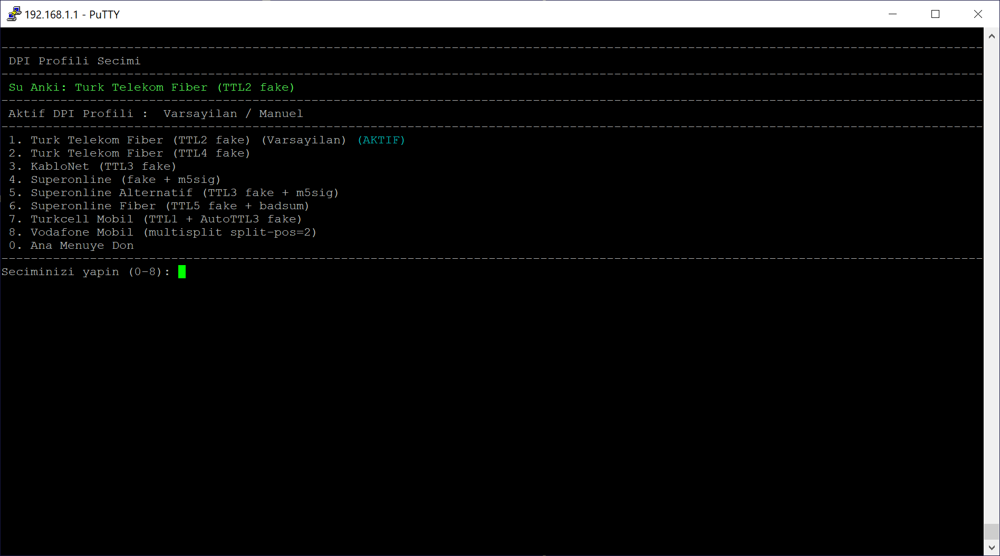

# keenetic-zapret-manager

📦 **Latest Release (recommended):**  
https://github.com/RevolutionTR/keenetic-zapret-manager/releases/latest

## 🔍 Hızlı Kurulum ve Menü Kılavuzu
https://github.com/RevolutionTR/keenetic-zapret-manager/blob/main/docs/kullanim_klavuzu.mddocs/kullanim_kilavuzu.md











## ✅ Test Edilen Keenetic OS Sürümleri

Bu betik aşağıdaki Keenetic OS sürümlerinde test edilmiştir:

- **Keenetic OS 5.0.5**
- **Keenetic OS 4.3.6.3**

> Daha eski Keenetic OS sürümlerinde test edilmemiştir.  
> Eski sürümlerde OPKG/Entware paketleri, iptables/ipset davranışı veya binary uyumluluğu farklı olabilir.

### ⚠️ USB Olmadan Kurulum Hakkında Önemli Uyarı

USB olmadan (cihazın dahili hafızasına / geçici ortama kurulum) yapılması durumunda aşağıdaki sorunlar kaçınılmazdır:
- Otomatik güncelleme (GitHub) çalışmayabilir
- Ayarlar reboot / elektrik kesintisi sonrası silinebilir
- Hostlist / Autohostlist / IPSET listeleri kalıcı olmaz
- keenetic / keenetic-zapret CLI kısayolları kaybolabilir
- Yedekleme / geri yükleme güvenilir çalışmaz
- "Çalışıyor gibi görünüp" DPI sitelerine erişim kesilebilir

**Bu bir betik hatası değildir.**  
Sebep, USB olmadan `/opt` dizininin kalıcı olmamasıdır.

**✅ Önerilen Kurulum:**
- Keenetic'e USB bellek takılı
- Entware USB'ye kurulu
- Betik ve Zapret `/opt` altında çalışıyor olmalı

---

## 📖 Proje Hakkında

**Keenetic router/modem'ler için Zapret yönetim ve otomasyon betiği**

Bu proje, Zapret'in Keenetic cihazlarda **kolay kurulumu**, **DPI profili yönetimi**,  
**IPSET ile istemci seçimi**, **menü tabanlı kullanım** ve  
**GitHub üzerinden sürüm takibi** için hazırlanmıştır.

### DNS Hakkında Önemli Not

Zapret, DPI (Deep Packet Inspection) tabanlı engellemeleri aşmak için tasarlanmıştır.  
**DNS tabanlı engellemeleri veya ISS DNS manipülasyonunu çözmez.**

Bu nedenle, bazı ISS'lerde Zapret kullanılırken:
- DoH (DNS over HTTPS),
- DoT (DNS over TLS),
- veya güvenilir bir üçüncü taraf DNS

kullanılması **şiddetle tavsiye edilir**.

ISS DNS sunucuları, engelli alan adları için hatalı IP döndürebilir.  
Bu durumda Zapret çalışıyor olsa bile bağlantı kurulamayabilir.

---

## 🚀 Özellikler

### Zapret Kurulum ve Yönetimi
- Zapret otomatik kurulum ve kaldırma
- Tek menüden tam kurulum / temiz kaldırma
- Zapret dosyalarının sistemden güvenli şekilde yönetilmesi

### DPI Profil Yönetimi
- Turk Telekom (Fiber / Alternatif)
- Superonline
- Superonline Fiber
- KabloNet
- Mobil operatörler (Turkcell / Vodafone)
- Profil değişiminden sonra **otomatik Zapret restart**

### IPSET Tabanlı Trafik Kontrolü
- Tüm ağa Zapret uygulama (**Global mod**)
- Sadece seçili IP'lere Zapret uygulama (**Smart mod**)
- IPSET listesi ile istemci bazlı kontrol

### Hostlist / Autohostlist Sistemi
- DPI algılanan domain'lerin otomatik öğrenilmesi (Autohostlist)
- Manuel domain ekleme / çıkarma (User hostlist)
- Hariç tutulan domain listesi (Exclude)

### IPv6 Desteği
- IPv6 Zapret desteği (isteğe bağlı)
- Menüden IPv6 açma / kapatma
- Durum ekranında renkli IPv6 gösterimi

### Yedekleme ve Geri Yükleme
- IPSET altında oluşan `.txt` dosyalarını tek tek yedekleme
- Seçili dosyaları geri yükleme
- Geri yükleme sonrası **otomatik Zapret restart**

### Sürüm ve Güncelleme Kontrolleri
- Kurulu Zapret sürüm bilgisi
- Manager (betik) sürüm kontrolü (GitHub)
- Güncel sürüm uyarıları

### CLI Kısayollar
- `keenetic`
- `keenetic-zapret`
- Script'i tam path yazmadan çalıştırabilme

### Çok Dilli Arayüz
- Türkçe / İngilizce (TR / EN) dil desteği
- Sözlük tabanlı çeviri sistemi

### Kullanıcı Dostu Arayüz
- Renkli ve okunabilir menü yapısı
- Net durum göstergeleri
- Hatalı yapılandırmalara karşı korumalar

---

## 🔍 Blockcheck → Otomatik DPI Akıllı Akışı

Blockcheck Özet (SUMMARY) sonucundan en stabil DPI parametresi otomatik tespit ediliyor.

Kullanıcıya karar ekranı sunuluyor:

- **[1] Uygula** → Parametre DPI profili olarak aktif edilir
- **[2] Parametreyi İncele**
- **[3] Sadece Kaydet**
- **[0] Vazgeç**

Otomatik DPI yalnızca özet testten çalışır (tam test direkt uygulamaz).

Aktif DPI durumu menüde açıkça gösterilir:
- Varsayılan / Manuel
- Blockcheck (Otomatik)

Uygulanan parametreler ayrıca listelenir.

---

## 📊 DPI Sağlık Skoru

Blockcheck sonrası DPI Health Score hesaplanır (örn. 8.5 / 10).

Alt kontroller kullanıcıya açık biçimde gösterilir:

- ✔ DNS tutarlılığı
- ✔ TLS 1.2 durumu
- ⚠ UDP 443 zayıf / riskli

Semboller ve metinler terminal uyumlu, okunabilir biçimde düzenlendi.

---
## 🤖 Telegram Bildirimleri
Router’dan anlık bildirim almak için:
➡️ [Telegram Kurulum Rehberi](docs/telegram.md)

---

## 🧹 Test Sonuçlarını Temizleme

**Blockcheck Test** menüsüne yeni seçenek eklendi:

**"Test Sonuçlarını Temizle"**

Aşağıdaki dosyalar güvenli şekilde silinir:
- `blockcheck_*.txt`
- `blockcheck_summary_*.txt`

Uzun vadede `/opt/zapret` dizininin şişmesi engellenir.

---

## 💾 Script Yedekleri Yönetimi

Script güncelleme sırasında otomatik yedek alınır.

Yedekler artık `.sh` uzantılı ve geri yüklenebilir durumda:

```
keenetic_zapret_otomasyon_ipv6_ipset.sh.bak_26.1.30_YYYYMMDD_HHMMSS.sh
```

**Yerel Depolama (Yedekler)** menüsüne yeni seçenek eklendi:

**"Yedekleri Temizle"**

Sadece bu betiğe ait yedekler temizlenir:
- `keenetic_zapret_otomasyon_ipv6_ipset.sh.bak_*`

---

## ⚠️ Ön Koşullar (ZORUNLU)

### 1️⃣ Entware Kurulmuş Olmalı

Keenetic arayüzünden:

```
Uygulamalar → Entware
```

Kurulumdan sonra SSH ile doğrulayın:

```sh
opkg --version
```

---

### 2️⃣ Gerekli OPKG Paketleri

Betiğin kendisi eksik paketleri otomatik olarak kontrol eder ve kurar.  
Manuel kurmak isterseniz:

```sh
opkg update
opkg install curl wget ipset iptables
```

---

## 📦 Kurulum

### 1️⃣ Betiği İndirin

GitHub repo veya **Releases** bölümünden aşağıdaki dosyayı indirin:

```
keenetic_zapret_otomasyon_ipv6_ipset.sh
```

---

### 2️⃣ Betiği `/opt` Altına Kopyalayın

> ⚠️ Betik **mutlaka `/opt` altında** çalıştırılmalıdır.

```sh
scp keenetic_zapret_otomasyon_ipv6_ipset.sh \
root@192.168.1.1:/opt/lib/opkg/
```

---

### 3️⃣ Çalıştırma İzni Verin

```sh
chmod +x /opt/lib/opkg/keenetic_zapret_otomasyon_ipv6_ipset.sh
```

---

### 4️⃣ Betiği Çalıştırın

```sh
/opt/lib/opkg/keenetic_zapret_otomasyon_ipv6_ipset.sh
```

---

## 🧩 İlk Kurulumda Ne Olur?

- OPKG paketleri kontrol edilir
- Zapret indirilir ve Keenetic'e uyarlanır
- Çıkış arayüzü sorulur (örnek: `ppp0`)
- Varsayılan DPI profili uygulanır:  
  **Turk Telekom Fiber (TTL2 fake)**
- Zapret otomatik olarak başlatılır

> DPI profili daha sonra menüden değiştirilebilir.

---

## 🎛️ DPI Profili Yönetimi

- Menüden DPI profili seçildiğinde:
  - Profil uygulanır
  - **Zapret otomatik olarak yeniden başlatılır**
- Manuel restart gerekmez

Aktif DPI profili:
- Menüde **yeşil renkle**
- **AKTİF** ibaresiyle gösterilir

---

## 🌐 IPSET (İstemci Seçimi)

IPSET menüsünün üstünde aktif mod otomatik olarak gösterilir:

- 🟢 **Mod: Tüm ağ**  
  → Tüm LAN istemcileri için Zapret aktif

- 🟡 **Mod: Seçili IP**  
  → Sadece girilen **statik IP'ler** için Zapret aktif

Yerel ağlar (RFC1918, loopback, CGNAT vb.) teknik olarak her zaman bypass edilir (`nozapret`).

---

## 🔄 Sürüm Kontrolü

- Zapret sürümü GitHub üzerinden sorgulanır
- Manager (betik) sürümü GitHub Release tag'i ile karşılaştırılır

### Sürüm Formatı

```
YY.AA.GG(.N)
```

Örnekler:
- `v26.1.24`
- `v26.1.24.2` → aynı gün yayınlanan ikinci sürüm

---

## 📜 Lisans

Bu proje **GNU GPLv3** lisansı ile yayınlanmıştır.

- Özgürce kullanabilir
- Değiştirebilir
- Dağıtabilirsiniz  

Ancak **aynı lisansla** paylaşılması zorunludur.

---

## ⚠️ Sorumluluk Reddi

Bu betik:
- Ağ trafiğini
- DPI / iptables / ipset yapılandırmalarını etkiler

Yanlış yapılandırmalar bağlantı sorunlarına yol açabilir.  
Kullanım tamamen **kullanıcının sorumluluğundadır**.

---

## 🤝 Katkı & Geri Bildirim

- Issue açabilirsiniz
- Feature request gönderebilirsiniz
- Pull Request'ler memnuniyetle karşılanır

📌 **GitHub Repo:**  
https://github.com/RevolutionTR/keenetic-zapret-manager
